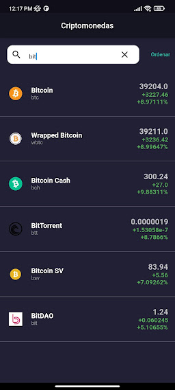

# Criptomonedas

Aplicación hecha en Flutter, obteniendo los datos de la Api de Coingecko

#### Flutter App Screenshots

<table>
  <tr>
    <td><h1>Login</h1></td>
     <td><h1>Items</h1></td>
    <td><h1>Details</h1></td>
  </tr>
  <tr>
    <td></td>
    <td></td>
    <td></td>
  </tr>
 </table>
